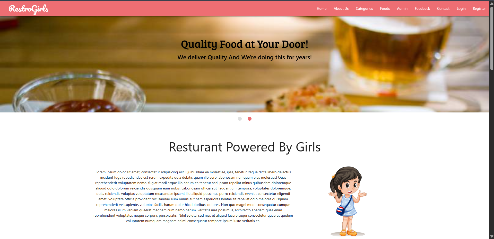
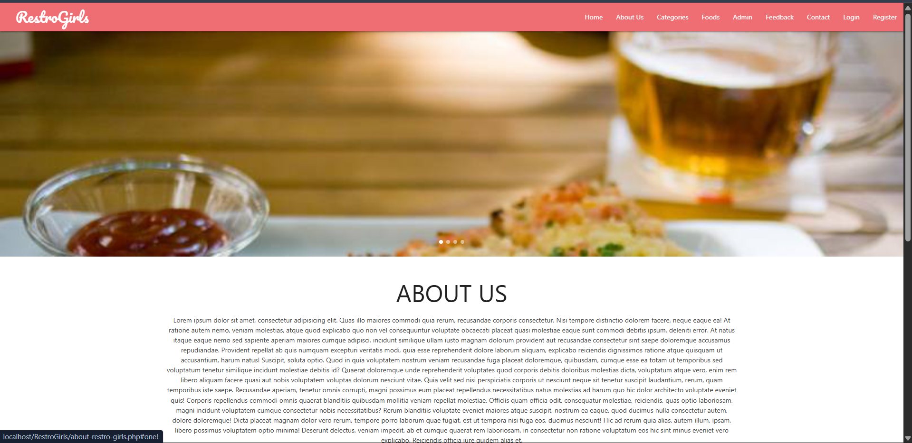
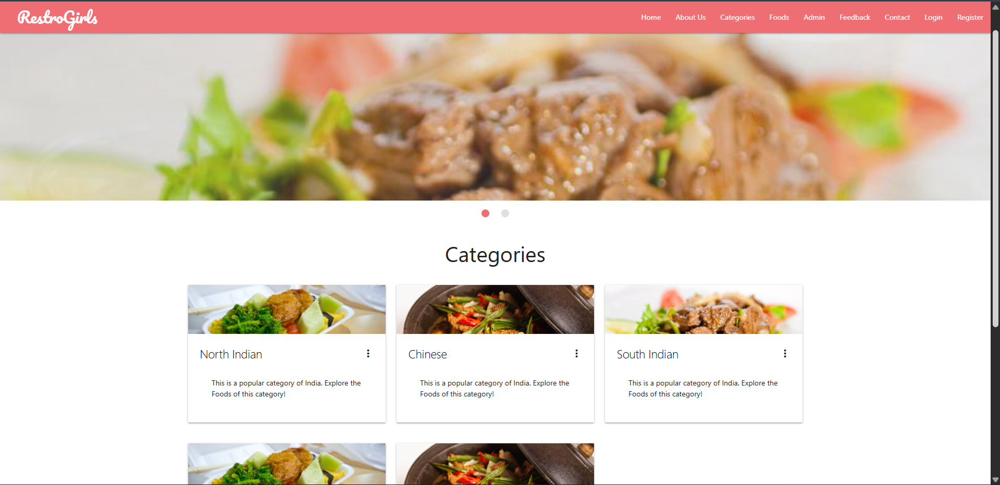
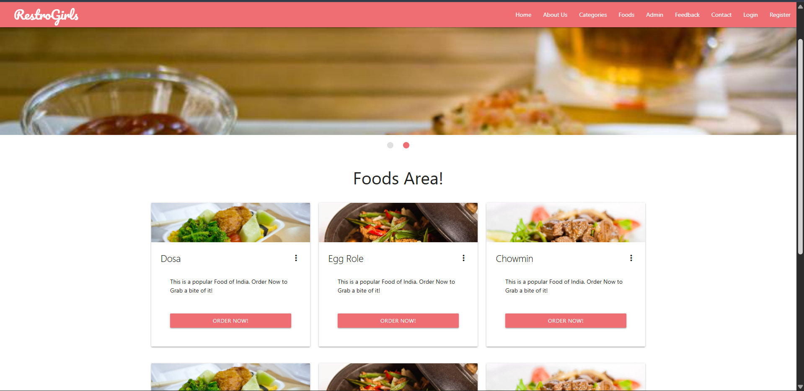
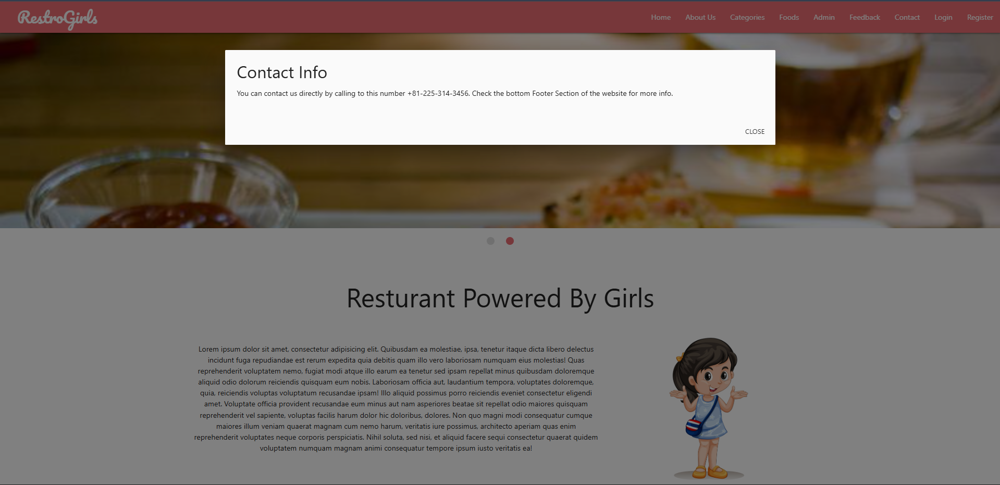
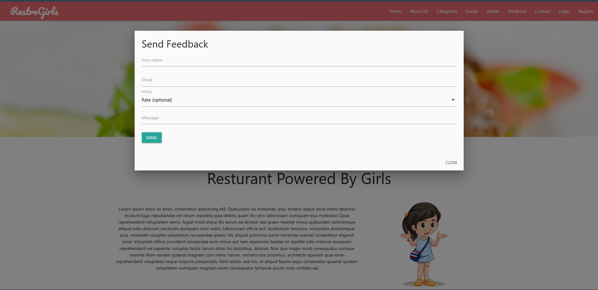
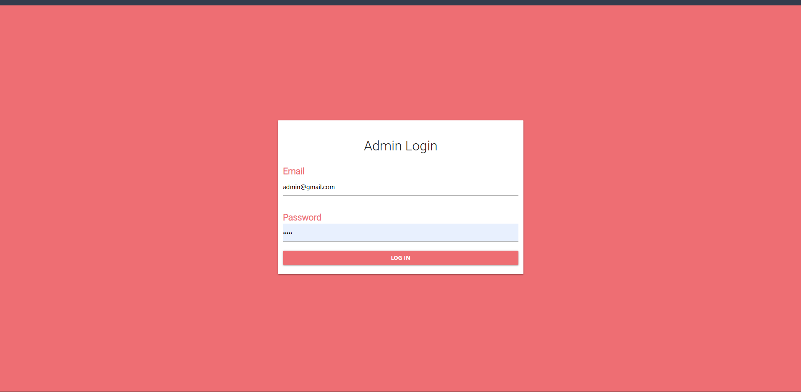
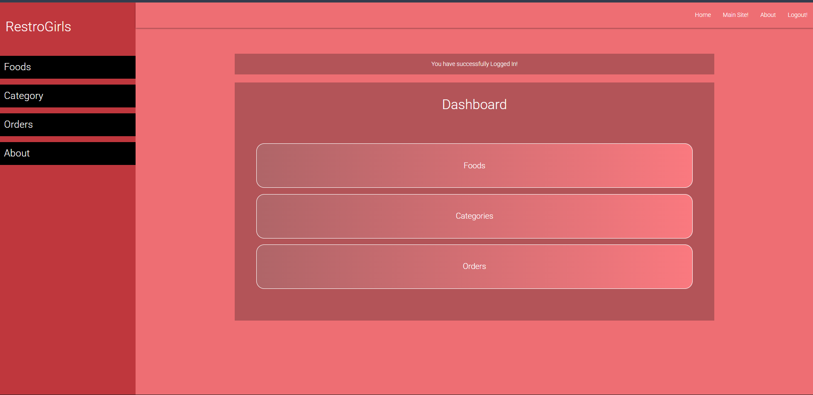
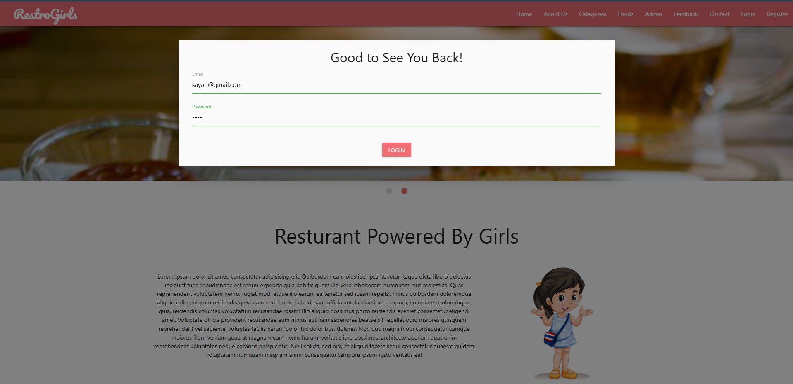
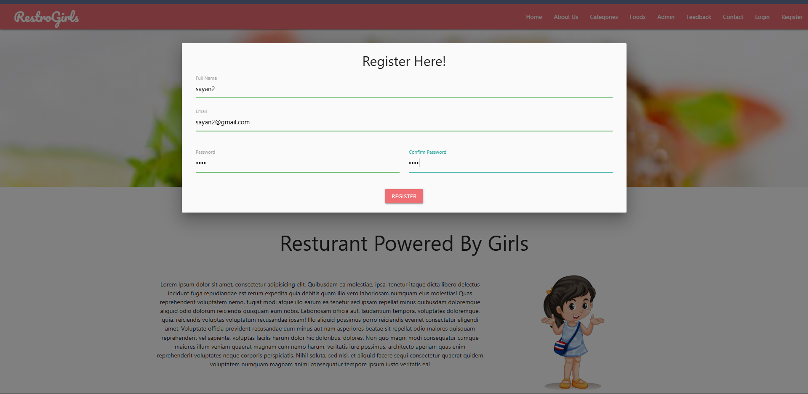

<h1>🍽️ RestroGirls – Food Delivery Web Application</h1>

<p>RestroGirls is a responsive food delivery web application designed to provide users with an easy and smooth food ordering experience. The platform includes a user-friendly frontend and a secure admin panel for managing foods, categories, and orders.</p>

-----------------------------------------------------------------------------------------------------------
<h2>🚀 Features</h2>
<h3>👨‍🍳 User Side </h3>

Beautiful and responsive homepage

Browse food categories (North Indian, South Indian, Chinese, etc.)

View food items with images and descriptions

Order food online

Contact information popup

Feedback form with rating system

User authentication (Login / Register)

<h3>🛠️ Admin Panel </h3>

Secure Admin Login

Dashboard overview

Manage Foods

Manage Categories

Manage Orders

Logout functionality

-----------------------------------------------------------------------------------------------------------

<h2>🖼️ Screenshots</h2>





















-----------------------------------------------------------------------------------------------------------

<h2>🧑‍💻 Technologies Used</h2>
<h3>Frontend </h3>

  HTML5

  CSS3

  JavaScript

  Bootstrap

<h3>Backend </h3>

  PHP

  MySQL

<h3>Tools </h3>

  XAMPP

  VS Code

-----------------------------------------------------------------------------------------------------------

<h2>📂 Project Structure </h2>
  RestroGirls/<br>
│
├── admin/<br>
│   ├── dashboard.php<br>
│   ├── foods.php<br>
│   ├── categories.php<br>
│   └── orders.php<br>
│
├── assets/<br>
│   ├── css/<br>
│   ├── js/<br>
│   └── images/<br>
│
├── includes/<br>
│   ├── db.php<br>
│   ├── footer.php<br>
│   └── header.php<br>
│
├── index.php<br>
├── about-restro-girls.php<br>
├── categories.php<br>
├── contact.php<br>
├── food-menu.php<br>
├── feedback.php<br>
├── login.php<br>
├── register.php<br>
├── logout.php<br>
└── README.md

-----------------------------------------------------------------------------------------------------------

<h2>⚙️ Installation Steps</h2>

1.Install XAMPP

2.Clone the repository:

  ```git clone https://github.com/your-username/RestroGirls.git```


3.Move the project to:

   ```C:\xampp\htdocs\```


4.Start Apache and MySQL from XAMPP

5.Import the database:

 5.1 Open phpMyAdmin

 5.2Create a database (e.g. restrogirls)

 5.3Import the .sql file

6.Update database connection in db.php

7.Open browser and run:

 ```http://localhost/RestroGirls/```
-----------------------------------------------------------------------------------------------------------
<h2>🔐 Admin Login (Default)</h2>
Email: admin@gmail.com
Password: 12345


(Change credentials after first login for security)
-----------------------------------------------------------------------------------------------------------
<h2>📌 Future Enhancements </h2>

Online payment gateway

Order tracking system

Email notifications

User order history

Admin analytics dashboard

-----------------------------------------------------------------------------------------------------------
<h2>🙌 Author</h2>

Sayan Adhikary
📍 India
💻 Web Developer (HTML, CSS, JS, PHP, MySQL)

-----------------------------------------------------------------------------------------------------------
<h2>📄 License</h2>

-----------------------------------------------------------------------------------------------------------
<h2>📞 Contact</h2>
For any queries or support, please contact:<br>
Email:  sayanadhikary831@gmail.com<br>
Website: https://sayanadhikary.free.nf/<br>
-----------------------------------------------------------------------------------------------------------
<h2>⭐️ Support </h2>
If you find this project useful, please give it a star on GitHub! Your support is greatly appreciated.<br>
--- IGNORE ---